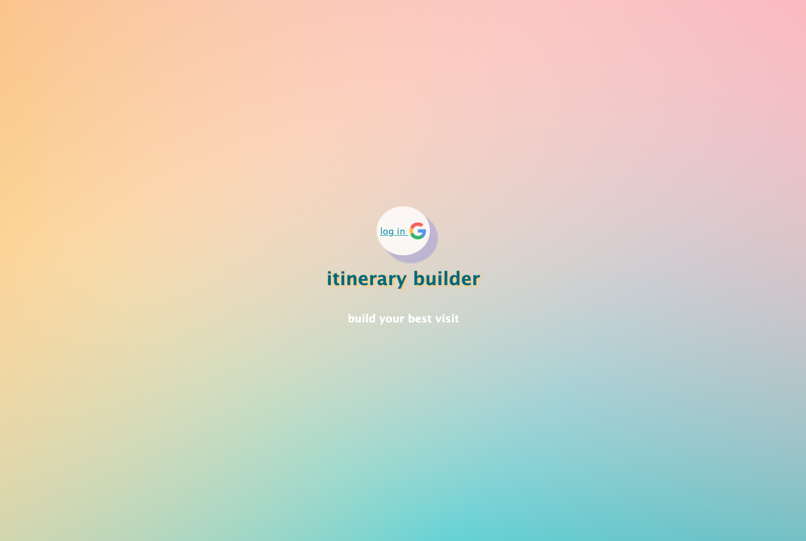
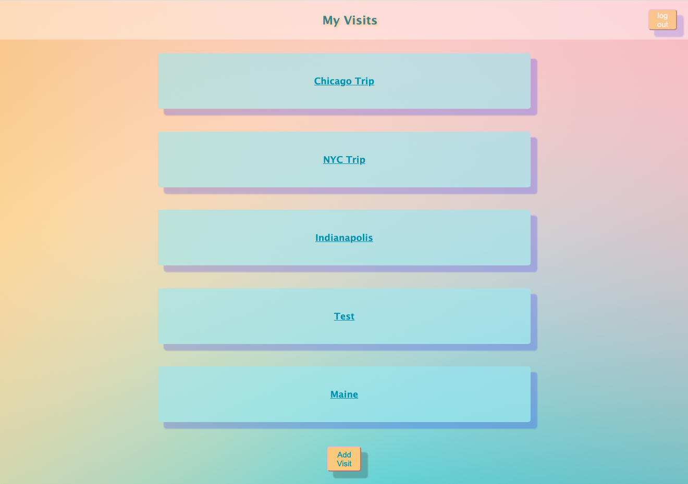
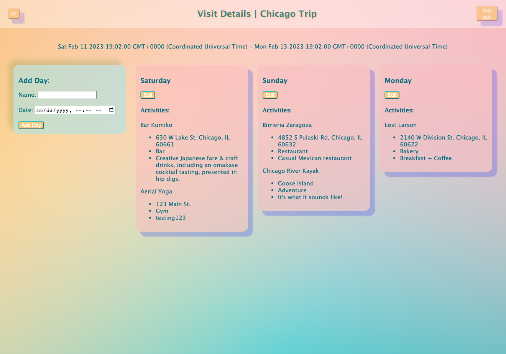
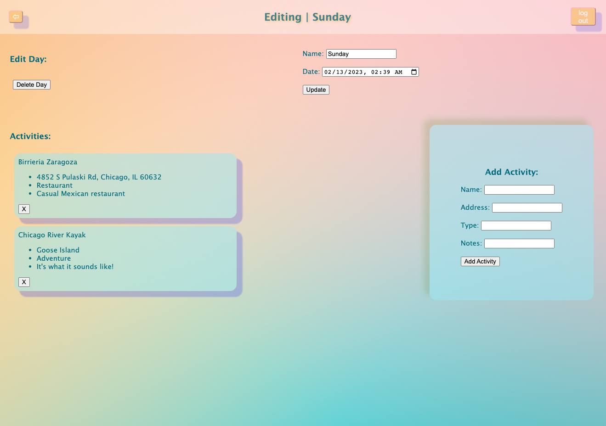

Welcome to Itinerary Builder, a full-stack web app where you can build and organize your next visit.

☐ Technologies Used: 
- Node, Express, MongoDB, JavaScript, HTML, CSS

☐ Getting Started:
- Navigate to: https://itinerary-builder.herokuapp.com/
- Log in using your google account
- Once logged in, create visits, add days to each visit, and assign activities to each day

☐ Next Steps:
- Improve styling: add timeline to each day, responsive CSS, etc
- Add "browse activities" index view funcitonality for Activities
- Drag and drop to move activities from day-to-day
- Implement Google Maps Places API for Activities
- Add search funcitonality so that users can add existing activities to days
